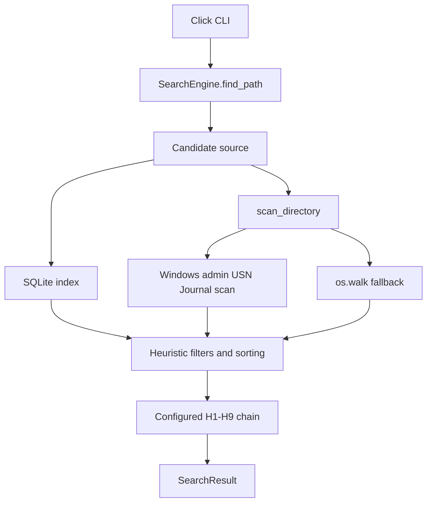

# sempath - PLAN

This plan describes the current implementation rather than a speculative design.
It should stay aligned with `README.md`, `config.yaml`, `.agents/AGENTS.md`, and
the code under `src/`.

## Vision

Build a Windows-first Python CLI that lets humans and LLM agents resolve
filesystem paths from fuzzy descriptions without knowing exact spelling, casing,
or directory layout.

Examples:

- `"desktop/main"` -> `C:\Users\Leonardo\Desktop\__MAIN`
- `"the main dir on dsktp"` -> `C:\Users\Leonardo\Desktop\__MAIN`
- `"Principal"` -> `C:\Users\Leonardo\Desktop\__MAIN`
- `"important folder"` -> `C:\Users\Leonardo\Desktop\__MAIN`
- `"dl"` -> `C:\Users\Leonardo\Downloads`

Project constraints from `.agents/AGENTS.md`:

- Windows is the MVP target; cross-platform support is deferred.
- Sizes must be formatted in human-readable units with exactly two decimal
  places.
- User-facing CLI output should use Rich styling where relevant.
- When reporting a fully passing test run, append a cute ASCII `BANZAI~!`
  message.

## Implemented Tech Stack

- Python 3.11+
- Click for the command tree and interactive prompts
- Rich for styled console output in the CLI layer
- PyYAML for config and learned-memory files
- RapidFuzz for fuzzy scoring
- pathspec for `.gitignore` parsing
- jellyfish for Metaphone phonetic matching
- SQLite for persistent path indexing
- pytest and Ruff for validation

Runtime-dependent integrations:

- H7 imports `sentence-transformers` lazily when semantic matching is attempted.
  It is intentionally not installed as a default dependency; use the `semantic`
  extra to install it.
- H8 calls a configured OpenAI-compatible chat-completions endpoint. Defaults are
  set for Ollama at `http://localhost:11434/v1`.

## Execution Pipeline

1. `src.cli.find` loads merged config and passes flags to `SearchEngine`.
2. `SearchEngine.find_path` resolves the search root.
3. Candidate paths are gathered:
   - if indexing is enabled, `IndexManager` auto-creates or updates the SQLite
     index for an unindexed root;
   - otherwise, `scan_directory` performs an on-the-fly scan.
4. `extract_heuristics` parses temporal, type, latest/newest, and largest/biggest
   clues.
5. CLI flags and heuristics are merged.
6. Candidates are filtered by extension and modification age, then sorted by
   latest or largest when requested.
7. Empty, `"."`, or `"*"` queries can return the top filtered candidate directly
   through the `explicit_flags` handler label.
8. The configured H1-H9 chain runs.
9. The engine returns a `SearchResult` with status `success`, `ambiguous`, or
   `failed`.



## Handler Interface

Implemented in `src.handlers.base`:

```python
class BaseHandler(ABC):
    name: str = "base"

    def __init__(self, config: dict) -> None:
        self.config = config
        self.next_handler: BaseHandler | None = None

    def set_next(self, handler: BaseHandler) -> BaseHandler:
        self.next_handler = handler
        return handler

    @abstractmethod
    def match(self, query: str, candidates: list[Path]) -> MatchResult | None:
        ...

    def handle(self, query: str, candidates: list[Path]) -> MatchResult | None:
        result = self.match(query, candidates)
        if result is not None:
            return result
        if self.next_handler is not None:
            return self.next_handler.handle(query, candidates)
        return None
```

`build_chain` reads `handlers.enabled`, validates handler names through
`HANDLER_REGISTRY`, instantiates each handler, and links them in order.

## Handlers

### H1 - Exact

- File/folder name match.
- Stem match for files.
- Multi-part suffix match for path-like queries.
- Tie-breaker: shortest path depth.
- Confidence: `1.0`.

### H2 - Case-insensitive

- Same matching surface as H1, but lowercase-normalized.
- Tie-breaker: shortest path depth.
- Confidence: `0.95`.

### H3 - Token-normalized

- Uses `src.utils.tokenize.normalize_tokens`.
- Compares unordered token sets for names, stems, and multi-part suffixes.
- Tie-breaker: shortest path depth.
- Confidence: `0.9`.

### H4 - Fuzzy

- Uses RapidFuzz.
- Scores against name, stem, and multi-part suffixes.
- Threshold comes from `handlers.h4_threshold`, default `75`.
- Confidence: ratio divided by `100`.

### H5 - Phonetic

- Implemented with jellyfish Metaphone.
- Compares phonetic code sets for names, stems, and multi-part suffixes.
- Tie-breaker: shortest path depth.
- Confidence: `0.75`.

### H6 - Alias

- Loads learned aliases from `learned_aliases.yaml`.
- Loads configured aliases from config.
- Alias keys support:
  - exact case-insensitive match;
  - regex keys when regex markers are present;
  - RapidFuzz key matching at ratio `>= 80`;
  - jellyfish Metaphone key matching.
- Direct aliases resolve to learned paths or configured target names/stems.
- Compound routing supports `"<sub query> on <alias>"` and
  `"<sub query> in <alias>"`.
- Routed subqueries can apply heuristic extension, age, and latest filters before
  exact/case-insensitive/fuzzy matching within the resolved alias directory.
- Confidence: `0.95`.

### H7 - Embedding

- Optional semantic fallback through lazy `sentence-transformers` import.
- In interactive mode, asks for confirmation before loading the model.
- In non-interactive mode, skips the confirmation prompt and attempts the import.
- Uses `handlers.h7_model`, default `all-MiniLM-L6-v2`.
- Returns the highest cosine-similarity candidate.
- Confidence: cosine similarity score.

### H8 - LLM rewrite

- Sends the query to `h8_url.rstrip("/") + "/chat/completions"`.
- Uses `h8_provider`, `h8_model`, and optional `h8_api_key` from config.
- Requests a canonical keyword/marker rewrite.
- Runs a second-cycle fast chain containing only H1-H6.
- Returns the second-cycle match with handler label like
  `h8_llm(h1_exact)`.
- No persistent cache is currently implemented.

### H9 - Interactive

- Disabled by `--non-interactive`.
- Uses RapidFuzz to rank up to five candidates with confidence `>= 0.2`.
- Uses Click prompt selection.
- Confirmed selections are saved through `add_or_update_memory`.
- Returns confidence `1.0`.

## Heuristics And Explicit Flags

Implemented in `src.heuristics` and merged in `SearchEngine`:

- Type words:
  - `pic`, `photo`, `image` -> image extensions
  - `doc`, `document` -> document extensions
  - `pdf` -> `pdf`
- Temporal words:
  - `today` and `yesterday` -> last 24 hours
  - `last week` -> last 7 days
  - `last month` -> last 30 days
- Ordering:
  - `latest`, `newest`
  - `largest`, `biggest`
- Explicit CLI flags:
  - `--latest`
  - `--largest`
  - `--ext`

## Indexing And Scanner

`IndexManager` stores `index.db` under `index.store`.

Tables:

- `indexed_roots(path, indexed_at)`
- `paths(path, basename, parent_dir, mtime, size, is_dir, tokens, phonetic)`

Index lifecycle:

- `sempath index create [PATH]`
- `sempath index update [PATH]`
- `sempath index list`
- `sempath index remove [PATH]`
- `sempath index remove --all`

Scanner behavior:

- Standard fallback uses `os.walk`.
- Hidden names and configured exclusions are skipped.
- Nested `.gitignore` files are respected through `pathspec`.
- On Windows as Administrator, the scanner first tries a read-only USN Journal
  enumeration through `src.utils.mft_reader.scan_volume_files`.
- USN results are filtered by root, depth, hidden/excluded names, and
  `.gitignore`.

## Learned Memory

Implemented in `src.utils.memory`.

Default path:

- `%APPDATA%\sempath\learned_aliases.yaml`
- fallback: `~/.config/sempath/learned_aliases.yaml`

Entry shape:

```yaml
- query: desktop main
  path: C:\Users\Leonardo\Desktop\__MAIN
  timestamp: "2026-06-22T10:00:00Z"
  hits: 1
  decay_rank: 1.0
```

Implemented operations:

- `load_memory`
- `save_memory`
- `add_or_update_memory`
- `undo_last_memory`
- `merge_memory_files`
- `sempath alias add/list/remove/clear/undo`
- `sempath export-memory`
- `sempath import-memory`

Decay rank uses a 7-day half-life formula:

```text
hits * 0.5 ^ (days_elapsed / 7)
```

## CLI Contract

```text
sempath find [OPTIONS] QUERY [ROOT_DIR]
sempath index create [OPTIONS] [PATH]
sempath index update [OPTIONS] [PATH]
sempath index list
sempath index remove [OPTIONS] [PATH]
sempath alias add NAME PATH
sempath alias list
sempath alias remove NAME
sempath alias clear
sempath alias undo
sempath export-memory FILE_PATH
sempath import-memory FILE_PATH
```

`find` options:

| Flag | Default | Implementation |
|---|---:|---|
| `--root` | `None` | Overrides positional `ROOT_DIR`. |
| `--depth` | `5` | Limits scan and index creation depth. |
| `--min-confidence` | `0.3` | Required confidence for success. |
| `--top-n` | `1` | Limits printed near misses in text output. |
| `--non-interactive` | `false` | Disables H9 and skips H7 confirmation. |
| `--no-index` | `false` | Forces direct scan. |
| `--json` | `false` | Prints `SearchResult.to_dict()` as JSON. |
| `--verbose` | `false` | Enables extra diagnostic output. |
| `--latest` | `false` | Sorts filtered candidates by modification time. |
| `--largest` | `false` | Sorts filtered candidates by file size. |
| `--ext` | `None` | Filters by extension. |

## JSON Schemas

Success:

```json
{
  "status": "success",
  "query": "desktop/main",
  "match": {
    "path": "C:\\Users\\Leonardo\\Desktop\\__MAIN",
    "confidence": 1.0,
    "handler": "h1_exact"
  }
}
```

Ambiguous:

```json
{
  "status": "ambiguous",
  "query": "dsktp/maine",
  "message": "No match found above confidence threshold.",
  "near_misses": [
    {
      "path": "C:\\Users\\Leonardo\\Desktop\\__MAIN",
      "confidence": 0.85,
      "handler": "h4_fuzzy"
    }
  ]
}
```

Failure:

```json
{
  "status": "failed",
  "query": "unknown_path",
  "message": "No candidate paths or near-misses matched the query.",
  "near_misses": []
}
```

## Configuration

`load_config` resolution order:

1. explicit path passed to `load_config`;
2. `%APPDATA%\sempath\config.yaml`;
3. bundled `config.yaml`;
4. `DEFAULT_CONFIG` in `src.config`.

Loaded config is deep-merged over defaults. Windows-style `%VAR%` segments are
expanded in `index.store`.

Current default shape:

```yaml
handlers:
  enabled: [h1, h2, h3, h4, h5, h6, h7, h8, h9]
  h4_threshold: 75
  h7_model: all-MiniLM-L6-v2
  h8_provider: ollama
  h8_model: llama3
  h8_url: http://localhost:11434/v1
  h8_api_key: ""

index:
  auto: true
  store: "%APPDATA%\\sempath\\cache"
  exclude_patterns:
    - "node_modules"
    - ".git"
    - "venv"
    - "__pycache__"
    - ".mypy_cache"
    - ".pytest_cache"
    - "build"
    - "dist"

aliases:
  main: [__MAIN, principal, important, primary, master]
  dl: [Downloads, download]
  docs: [Documents, documentation, docs]
```

## Directory Structure

```text
sempath/
|-- pyproject.toml
|-- README.md
|-- PLAN.md
|-- config.yaml
|-- src/
|   |-- __init__.py
|   |-- __main__.py
|   |-- cli.py
|   |-- config.py
|   |-- engine.py
|   |-- heuristics.py
|   |-- scanner.py
|   |-- index.py
|   |-- models.py
|   |-- chain.py
|   |-- handlers/
|   |   |-- __init__.py
|   |   |-- base.py
|   |   |-- h1_exact.py
|   |   |-- h2_case_insensitive.py
|   |   |-- h3_token_normalized.py
|   |   |-- h4_fuzzy.py
|   |   |-- h5_phonetic.py
|   |   |-- h6_alias.py
|   |   |-- h7_embedding.py
|   |   |-- h8_llm.py
|   |   `-- h9_interactive.py
|   `-- utils/
|       |-- __init__.py
|       |-- memory.py
|       |-- tokenize.py
|       |-- scoring.py
|       `-- mft_reader.py
`-- tests/
    |-- conftest.py
    |-- test_alias_handler.py
    |-- test_chain.py
    |-- test_cli.py
    |-- test_cli_alias.py
    |-- test_cli_flags.py
    |-- test_config.py
    |-- test_engine_and_handlers.py
    |-- test_handlers.py
    |-- test_heuristics.py
    |-- test_index.py
    |-- test_memory.py
    |-- test_mft.py
    |-- test_models.py
    |-- test_phonetic.py
    |-- test_scanner.py
    `-- test_utils.py
```

## Implementation Status

Completed:

- project scaffolding and packaging;
- config loading and validation;
- scanner with exclusions, `.gitignore`, and Windows admin USN path;
- H1-H9 handlers;
- heuristic parsing and explicit find flags;
- learned memory, alias CLI, and memory import/export;
- SQLite indexing commands and auto-index integration;
- JSON result schemas;
- tests for handlers, CLI, scanner, index, memory, MFT integration, models, and
  utilities.

Known follow-ups:

- Broaden platform-specific behavior once Windows MVP requirements settle.
- Add more performance hardening for very large trees.
