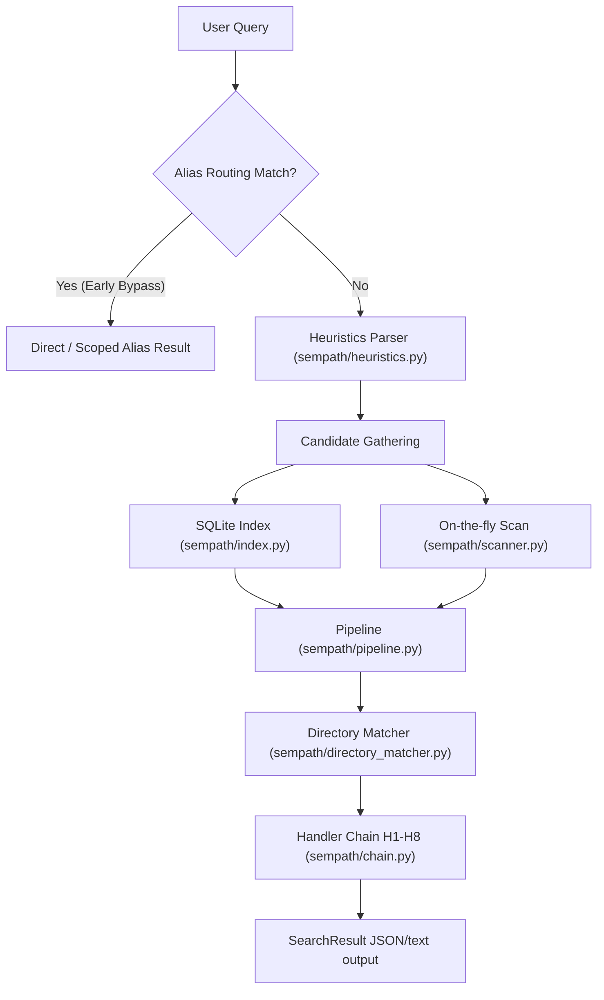

# sempath

`sempath` is a Windows-first Python CLI for finding filesystem paths from vague,
colloquial, misspelled, semantically fuzzy, or wildcard/glob (e.g. `*.txt`) descriptions.
It features config-driven ad hoc category keyword tags (e.g. `docs`, `pics`) and is meant to be
usable by both humans and LLM agents that need reliable path resolution without
knowing exact casing, spelling, or directory names.

## Examples

- `"desktop/main"` -> `C:\Users\Leonardo\Desktop\__MAIN`
- `"the main dir on dsktp"` -> `C:\Users\Leonardo\Desktop\__MAIN`
- `"Principal"` -> `C:\Users\Leonardo\Desktop\__MAIN`
- `"important folder"` -> `C:\Users\Leonardo\Desktop\__MAIN`
- `"dl"` -> `C:\Users\Leonardo\Downloads`

## Current Status

The current implementation includes the Click/Rich CLI, filesystem scanning,
SQLite indexing, heuristic parser, a candidate filtering/sorting pipeline,
directory content matching logic, handlers H1 through H8, learned alias memory,
memory import/export, Windows admin USN Journal acceleration, and tests.

> [!IMPORTANT]
> To avoid Windows environment/path conflicts (such as Anaconda shadowing standard Python), always use `py -3.13` to explicitly target the correct environment for installation and testing:
> ```powershell
> py -3.13 -m pip install -e .
> py -3.13 -m pytest
> ```
> These are the only commands guaranteed to install the package and run the test suite properly without environment mismatch issues.

Last local verification: 130 tests passed on Python 3.13.1.

## Project Rules

These rules are also captured in `AGENTS.md` and should stay true in
future code and docs changes:

- The MVP targets the host machine on Windows. Cross-platform support is deferred.
- File and directory sizes must be human-readable with exactly two decimal places.
- User-facing CLI output should use Rich styling where relevant.

## Tech Stack

- Python 3.11+
- Click for subcommand routing and prompts
- Rich for styled CLI output
- PyYAML for config and learned-memory files
- RapidFuzz for fuzzy string scoring
- pathspec for `.gitignore` support
- jellyfish for Metaphone phonetic matching
- SQLite for the persistent path index
- pytest and Ruff for test and lint tooling

Optional runtime integrations:

- `sentence-transformers` powers H7 semantic embedding matches when installed.
  It is lazy-imported and installable with `pip install -e .[semantic]` from
  this checkout, or `pip install sempath[semantic]` for an installed package.
- H8 calls an OpenAI-compatible chat-completions endpoint, configured for Ollama
  by default.

## Architecture

`sempath` resolves a query through a decoupled processing pipeline, orchestrated by the central `SearchEngine` (in `sempath/engine.py`):

1. **Alias Routing**: Performs early bypass check for alias matches and handles sub-query routing (e.g., `"<sub query> on <alias>"`) using direct path resolution (via `sempath/handlers/h6_alias.py`).
2. **Candidate Gathering**: Gathers candidate paths from the SQLite index (via `sempath/index.py`) or scans on the fly with `--no-index` (via `sempath/scanner.py`).
3. **Heuristics Extraction**: Extracts query constraints (such as file extensions, age/temporal filters, sorting intents like latest/oldest, or largest/smallest) from the query string (via `sempath/heuristics.py`).
4. **Pipeline Filtering & Sorting**: Filters candidates by intent (file/directory), extensions, age constraints, and sorts candidates (via `sempath/pipeline.py`).
5. **Directory Matching**: Resolves queries targeting files inside a matching directory (via `sempath/directory_matcher.py`).
6. **Handler Chain Execution**: Runs the candidate list through the configured handler chain of matching strategies H1 through H8 (via `sempath/chain.py`).
7. **Result Dispatch**: Returns a success, ambiguous near-miss, or failure search result.



## Handlers

The default handler order is configured in `config.yaml`:

```yaml
handlers:
  enabled: [h1, h2, h3, h4, h5, h6, h7, h8]
```

| Handler | Implemented behavior |
|---|---|
| H1 Exact | Exact basename, stem, or path-suffix match. Supports case-sensitive globbing. |
| H2 Case-insensitive | Case-insensitive basename, stem, or path-suffix match. Supports case-insensitive globbing. |
| H3 Token-normalized | Normalizes alphanumeric and wildcard tokens and compares unordered sets via bijection globbing. |
| H4 Fuzzy | RapidFuzz ratio against name, stem, and path suffixes. Destructures wildcard queries by stripping `*`/`?`. |
| H5 Phonetic | jellyfish Metaphone comparison for name, stem, and path suffixes. Destructures wildcard queries by stripping `*`/`?`. |
| H6 Alias | Config aliases and learned aliases with exact, regex, fuzzy, and phonetic key matching. Supports wildcard targets and `"<sub query> on <alias>"` / `"<sub query> in <alias>"` routing. |
| H7 | Embedding | Optional lazy `sentence-transformers` semantic match. Prompts before loading in interactive mode. Translates wildcard queries to descriptions before encoding. Enforces a minimum similarity threshold of 0.5. |
| H8 | LLM direct match | Direct semantic path selector. Sends candidates and query to an OpenAI-compatible endpoint (defaults to local Ollama with `minimax-m3:cloud`), returns matched relative paths. Bounded to a maximum of 100 candidates to prevent timeout. Under exhaustive mode, LLM clamping is unbounded up to candidate count; otherwise manually clamped via `-N` or `h8_top_k`. |

## CLI

To view standard help and the main options, run:
```bash
sempath --help
```

To view comprehensive help showing all options, arguments, and descriptions for **every possible command and subcommand** recursively, run:
```bash
sempath --help-full
```

### Usage
```bash
sempath find [OPTIONS] QUERY [ROOT_DIR]
sempath index create [OPTIONS] [PATH]
sempath index update [OPTIONS] [PATH]
sempath index list
sempath index remove [OPTIONS] [PATH]
sempath alias add NAME PATH
sempath alias list
sempath alias remove NAME
sempath alias clear
sempath alias undo
sempath config verbose VALUE
sempath config gitignore VALUE
sempath export-memory FILE_PATH
sempath import-memory FILE_PATH
```

### `find` Options

| Option | Default | Description |
|---|---:|---|
| `--root` | `None` | Root directory to search, overriding the positional `ROOT_DIR`. |
| `--depth` | `5` | Maximum folder depth to traverse. |
| `--min-confidence` | `0.3` | Minimum confidence score needed for success. |
| `--top-n` | `5` | Number of near misses to print in text output. (Can be clamped via `-[integer]` suffix, e.g. `sempath find "pic" -3`). |
| `--non-interactive` | `false` | Skip the H7 semantic model confirmation prompt. |
| `--no-index` | `false` | Force on-the-fly scanning instead of SQLite index use. |
| `--json` | `false` | Emit structured JSON. |
| `--verbose` | `false` | Enable detailed under-the-hood diagnostics, category matching, and handler execution logs. |
| `--latest` | `false` | Sort filtered candidates by newest modification time. |
| `--largest` | `false` | Sort filtered candidates by largest file size. |
| `--smallest` | `false` | Sort filtered candidates by smallest file size. |
| `--oldest` | `false` | Sort filtered candidates by oldest modification time. |
| `--ext` | `None` | Keep candidates with the given extension. |
| `--handlers` | `None` | Restrict executing handlers. Accepts a spec range, CSV, or single ID, e.g. `--h8`, `--h1-6`, `--h2,h4,h5`. |
| `--gitignore` | `false` | Flip the configured respect_gitignore setting (e.g. ignores gitignore if enabled, or respects it if disabled). |
| `--read-content` | `false` | Search within the actual text content of human-readable files. |

## Indexing And Scanning

By default, `find` uses the SQLite index when `index.auto` is true. If the root is
not indexed yet, the engine creates or updates the index automatically before
querying it. Pass `--no-index` to force a direct filesystem scan.

The scanner:

- ignores hidden names and configured exclusions such as `.git`, `node_modules`,
  virtualenvs, build outputs, and Python caches;
- respects nested `.gitignore` files with `pathspec`;
- on Windows, tries a read-only USN Journal scan when running as Administrator;
- falls back to `os.walk` when USN scanning is unavailable.

## Learned Memory

Learned aliases are stored at `%APPDATA%\sempath\learned_aliases.yaml` on
Windows, or under the user config directory fallback when `APPDATA` is not set.

Each entry contains:

- `query`
- `path`
- `timestamp`
- `hits`
- `decay_rank`

The memory utilities recalculate decay rank on load, merge imported memory by
query/path, and support chronological undo through `sempath alias undo`.

## JSON Output

`--json` serializes the `SearchResult` model.

Success:

```json
{
  "status": "success",
  "query": "desktop/main",
  "match": {
    "path": "C:\\Users\\Leonardo\\Desktop\\__MAIN",
    "confidence": 1.0,
    "handler": "h1_exact"
  }
}
```

Ambiguous:

```json
{
  "status": "ambiguous",
  "query": "dsktp/maine",
  "message": "No match found above confidence threshold.",
  "near_misses": [
    {
      "path": "C:\\Users\\Leonardo\\Desktop\\__MAIN",
      "confidence": 0.85,
      "handler": "h4_fuzzy"
    }
  ]
}
```

### CLI Text Grouping

When printing search results in standard text output mode, near-misses and other candidate matches are automatically classified and grouped into:
1. **Other matches** (bold cyan): For files matching the query directly at the root.
2. **Subfolders** (bold): E.g., `3D-to-reGEN-to-VID/Annie Leonhart`, classifying matching items by their parent folder names relative to the search root.
3. **Generic/placeholder files** (dim cyan): Bucket for files with generic names (e.g. `unnamed`, `temp`, `untitled`), visually de-emphasizing them.

If a generic/placeholder file wins on score as the top match (e.g. `unnamed.jpg`), `sempath` automatically promotes the first non-generic candidate to primary success match, moving the generic file back into the appropriate grouped category display.

Failure:

```json
{
  "status": "failed",
  "query": "unknown_path",
  "message": "No candidate paths or near-misses matched the query.",
  "near_misses": []
}
```

## Configuration

Bundled defaults live in `config.yaml`; user config at
`%APPDATA%\sempath\config.yaml` is deep-merged over those defaults.

### CLI Verbose Command
You can persistently toggle verbose logging via the CLI command:
```bash
sempath config verbose [on|off|true|false]
```

### CLI Gitignore Command
You can persistently configure whether `.gitignore` rules are respected by default using:
```bash
sempath config gitignore [on|off|true|false]
```
This saves the configuration locally under `%APPDATA%\sempath\config.yaml` to override any system/package defaults.

```yaml
handlers:
  enabled: [h1, h2, h3, h4, h5, h6, h7, h8]
  h4_threshold: 75
  h7_model: all-MiniLM-L6-v2
  h8_provider: ollama
  h8_model: minimax-m3:cloud
  h8_url: http://localhost:11434/v1
  h8_api_key: ""
  h8_top_k: 6

index:
  auto: true
  store: "%APPDATA%\\sempath\\cache"
  exclude_patterns:
    - "node_modules"
    - ".git"
    - "venv"
    - "__pycache__"
    - ".mypy_cache"
    - ".pytest_cache"
    - "build"
    - "dist"

aliases:
  main: [__MAIN, principal, important, primary, master]
  dl: [Downloads, download]
  docs: [Documents, documentation, docs]
```

## Roadmap Snapshot

- Completed: scaffolding, config loading, models, scanner, H1-H8 handlers,
  heuristics, explicit flags, learned memory, SQLite indexing, memory
  import/export, CLI commands, Windows USN Journal scan path, and tests.
- Optional/runtime-dependent: H7 requires the `semantic` extra; H8 requires a
  reachable configured LLM endpoint.
- Future work: broader cross-platform tuning and additional performance
  hardening for very large trees.
