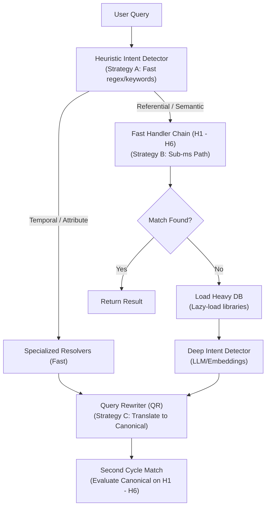

# sempath

A Python CLI tool designed to help humans and LLM agents find filesystem paths using vague, colloquial, misspelled, or semantically fuzzy descriptions. It eliminates the need to remember exact casings, paths, or naming conventions.

---

## 🌟 Vision

- `"desktop/main"` ➔ `C:\Users\Leonardo\Desktop\__MAIN`
- `"the main dir on dsktp"` ➔ `C:\Users\Leonardo\Desktop\__MAIN`
- `"Principal"` ➔ `C:\Users\Leonardo\Desktop\__MAIN` (Synonym)
- `"important folder"` ➔ `C:\Users\Leonardo\Desktop\__MAIN` (Semantic)
- `"dl"` ➔ `C:\Users\Leonardo\Downloads` (Alias)

> [!NOTE]
> **Platform Target:** Cross-platform support is deferred for now. The MVP is built specifically for the host machine (Windows OS).
>
> **File/Directory Size Output:** If outputting file or directory sizes, always format them in a human-readable format (e.g. KB, MB, GB) with exactly 2 decimal places.

---

## 🧰 Tech Stack

- **Python**: 3.11+
- **CLI Framework**: [Click](https://click.palletsprojects.com/) — subcommand-based CLI routing
- **Config**: PyYAML — YAML config and alias loading
- **Linter / Formatter**: [Ruff](https://docs.astral.sh/ruff/) — fast Python linter and formatter
- **Testing**: pytest
- **Terminal UI**: [Rich](https://rich.readthedocs.io/) — styled and colored CLI output

---

## 🏗️ Architecture: Dual-Path Intent Detection & Handler Chain

To maintain sub-millisecond response times for quick matches, `sempath` uses a dual-path execution model that combines lightweight heuristics with a lazy-loaded deep intent classifier.



---

## 🧠 Stateful Memory & Robust User Ratified Aliases

Unlike purely stateless CLI search engines, `sempath` remembers confirmations to build an intuitive, personalized interaction model, and treats alias matching as a robust semantic system:

1. **Learning confirmations (H9 Rich Memory):** When a query resolves to an interactive selection (H9) and the user confirms, the choice is saved to a persistent store (`%APPDATA%\sempath\learned_aliases.yaml`). To enable robust decay and prevent sub-query routing conflicts, each memory record tracks:
   - `query`: The original search query.
   - `path`: The confirmed target path.
   - `timestamp`: UTC timestamp of the confirmation.
   - `hits`: Usage frequency counter.
   - `decay_rank`: A ranking score calculated from hits and recency.
2. **Robust User Ratified Aliases (H6):** The Alias handler doesn't just check for exact string matches:
   - **Fuzzy / Phonetic Keys:** Alias keys (e.g., `DWL` -> `Downloads`) are checked via fuzzy matching, so `dwll` resolves directly with high confidence.
   - **Regex / Wildcard Mappings:** Confirmed/configured aliases can contain regex patterns.
   - **Context / Query Splitting:** If the query includes an alias and a sub-query (e.g., `"latest pic on MAIN"`), the system extracts the alias `MAIN`, resolves it to its directory (`C:\Users\Leonardo\Desktop\__MAIN`), and searches recursively within that directory for the remaining query (`"latest pic"`), resolving files matching image extensions sorted by creation/modification time.
3. **Chronological Undo Stack:** Aliases are logged chronologically. If you make a mistake, run `sempath alias undo` to revert the last learned alias.
4. **Deterministic execution & Feedback Loop:** Next time a query is matched via a learned alias, it resolves instantly and displays a feedback hint:
   `[i] Matched via learned alias: 'query' -> 'path' (run 'sempath alias undo' to revert)`
5. **Sharing/Attaching context:** LLM agents or remote deployment bots can export and import this state.
   - `sempath export-memory <export_path.yaml>`
   - `sempath import-memory <import_path.yaml>`

> [!TIP]
> **Embedding Latency Penalty Guard (H7 & H8):** 
> Loading heavy machine-learning libraries (`torch`, `sentence-transformers`) introduces a cold-start import lag of 1–2 seconds. To keep the fast matchers (H1–H6) operating at sub-millisecond speeds:
> 1. All heavy libraries are **lazy-imported** inside H7.
> 2. The CLI prompts the user with a confirmation request before running deep matchers: 
>    `[!] No quick match found. Fallback to Deep Semantic Search (sentence-transformers)? This may take 1-2 seconds. (Y/n):`
> This prompt can be bypassed via configuration file defaults or by passing the `--non-interactive` flag.

---

## 💻 CLI Interface

```bash
# Search for paths
sempath find [OPTIONS] <QUERY> [ROOT_DIR]

# Persistent Indexing
sempath index (create | update | list | remove) [ROOT_DIR]

# Managed Aliases / Custom Mappings
sempath alias (add | list | remove | clear | undo)

# Memory Import & Export
sempath export-memory <FILE_PATH>
sempath import-memory <FILE_PATH>
```

### Search Options

| Option | Default | Description |
|---|---|---|
| `--root` | `cwd` | Root directory to begin matching/traversal. |
| `--depth` | `5` | Maximum folder depth to traverse. |
| `--min-confidence` | `0.3` | Minimum confidence score (0.0 to 1.0) to return a match. |
| `--top-n` | `1` | Number of results to return. |
| `--non-interactive` | `false` | Disable interactive fallback (H9), return JSON near-misses instead. |
| `--no-index` | `false` | Force an on-the-fly traversal scan. |
| `--json` | `false` | Output structured JSON instead of stdout (for LLM agents). |
| `--verbose` | `false` | Enable handler-by-handler execution logs. |

---

## 🤖 LLM Agent Output Schema

When `--json` is enabled or in `--non-interactive` mode upon failure, the tool outputs structured JSON objects to ensure programmatic reliability for LLM agents.

### 1. Success Match Schema
```json
{
  "status": "success",
  "query": "desktop/main",
  "match": {
    "path": "C:\\Users\\Leonardo\\Desktop\\__MAIN",
    "confidence": 1.0,
    "handler": "h1_exact"
  }
}
```

### 2. Near-Misses Schema (Ambiguous Match)
Returned when no path matches above `--min-confidence`, but candidate paths exist within the near-miss threshold (e.g. `0.2`):
```json
{
  "status": "ambiguous",
  "query": "dsktp/maine",
  "message": "No match found above confidence threshold.",
  "near_misses": [
    {
      "path": "C:\\Users\\Leonardo\\Desktop\\__MAIN",
      "confidence": 0.85,
      "handler": "h4_fuzzy"
    },
    {
      "path": "C:\\Users\\Leonardo\\Downloads",
      "confidence": 0.35,
      "handler": "h7_embedding"
    }
  ]
}
```

### 3. Failure Schema
Returned when no paths match the query or fall within near-miss limits:
```json
{
  "status": "failed",
  "query": "unknown_path",
  "message": "No candidate paths or near-misses matched the query.",
  "near_misses": []
}
```

---

## 🛠️ Configuration (`config.yaml`)

```yaml
handlers:
  enabled: [h1, h2, h3, h4, h5, h6, h7, h8, h9]
  h4_threshold: 75
  h7_model: all-MiniLM-L6-v2
  h8_provider: ollama      # or openai, etc.
  h8_model: llama3
  h8_url: http://localhost:11434/v1
  h8_api_key: ""
  h9_timeout: 30

index:
  auto: true
  store: "%APPDATA%\\sempath\\cache"
  exclude_patterns:
    - "node_modules"
    - ".git"
    - "venv"
    - "__pycache__"

aliases:
  main: [__MAIN, principal, important, primary, master]
  dl: [Downloads, download]
  docs: [Documents, documentation, docs]
```

---

## 🗺️ Sequentially Phased Implementation Roadmap

### Phase 1: Scaffolding, Models & Config
- Set up directory structure, `pyproject.toml`, and config parser.
- Define shared interfaces (`BaseHandler`, `MatchResult`) and the pipeline builder (`Chain`).

### Phase 2: Scanner & Core Handlers (H1 - H4)
- Implement `scanner.py` using Python's standard `os.walk` with high-efficiency traversal filtering (ignoring `.git`, `node_modules`, virtualenvs, and dotfiles) to search the filesystem.
- Implement H1 (Exact), H2 (Case-Insensitive), H3 (Token-Normalized), and H4 (Fuzzy String with `rapidfuzz`).

### Phase 3: Phonetic, Config Aliases & Memory (H5 - H6)
- Implement H5 (Tentative: Phonetic matching using `jellyfish`'s Metaphone/Soundex algorithm, to be evaluated and potentially skipped if H4 fuzzy matching is sufficient).
- Implement H6 (Alias parsing from `config.yaml` and dynamic memory from `learned_aliases.yaml` utilizing the rich memory model).
- Implement `export-memory` and `import-memory` commands.

### Phase 4: Persistent Indexing
- Create a high-efficiency persistent index store (using **SQLite or a highly compressed binary database** instead of massive slow monolithic JSON files) containing pre-tokenized directory contents and modification checks (`mtime`).
- Implement CLI `index` subcommands.

### Phase 5: Heavy Matchers (H7 - H8)
- Implement H7 (Lazy-loaded `sentence-transformers` for semantic similarity scoring).
- Implement H8 (LLM Query Rewriter via Ollama / OpenAI API compatible endpoints to translate natural language queries to canonical queries).

### Phase 6: Interactive Fallback, Verification & Smoke Tests
- Implement H9 (Interactive prompt utilizing `questionary` or `inquirer` to confirm options).
- Add confirmation log appender to update the rich memory database (`query`, `path`, `timestamp`, `hits`, `decay_rank`).
- Add mock filesystem tests under `tests/` checking the exact execution path of the chain.

### Phase 7: Post-MVP Optimizations (Optional)
- Implement a low-level sequential NTFS **Master File Table (MFT) reader** for Administrator runs on Windows to sweep millions of files in seconds, serving as an optional acceleration layer.
